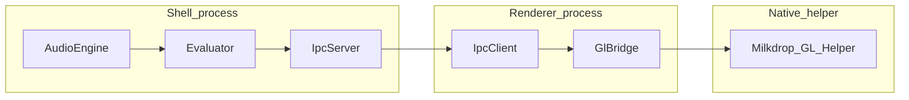

# Architecture

`gnome-milkdrop` runs as two cooperating JavaScript processes plus one native helper:

1. **GNOME Shell extension** (`src/extension/`)
2. **GTK4 renderer process** (`src/renderer/renderer.js`)
3. **Native GL helper** (`src/renderer/milkdrop-gl-helper`)

## Runtime Ownership

### Shell extension process

Owns lifecycle and shell safety-critical orchestration:

- monitor/renderer spawn-restart policy (`monitor.js`)
- audio capture and beat features (`audio.js`)
- preset indexing/probing/quarantine (`presets.js`, `preset-crash-quarantine.js`)
- per-frame evaluation (`evaluator.js`)
- extension-to-renderer socket IPC (`ipc.js`)
- D-Bus status endpoint `io.github.mauriciobc.Milkdrop` (`GetWindowStatus`)

### Renderer process

Owns rendering state and helper bridge:

- GtkGLArea render loop and frame scheduling (`glarea.js`)
- socket client from extension (`ipc-client.js`)
- bridge to native helper with backpressure handling (`gl-bridge.js`)
- helper lifecycle watchdog + telemetry (`gl-bridge.js`)

### Native helper process

Owns low-level GL execution:

- shader/program setup
- frame rendering
- optional shared-memory frame transfer to renderer

## Data Flow

## IPC Contracts (current)

### Extension <-> Renderer socket (newline-delimited JSON)

- renderer announces readiness with `type=ready` (+ `protocolVersion`)
- hot path: `type=frame`
- control path: `preset-load`, `set-text-overlay-visible`
- renderer telemetry path: `helper-ready`, `frame-stat`, `telemetry`, `shader_error`, `helper-crashed`

The socket queue is intentionally bounded to protect `gnome-shell` from blocking writes.

### Renderer <-> Helper stdin/stdout JSON

- renderer sends `init`, `resize`, `frame`, `shutdown`
- helper sends telemetry and frame metadata
- renderer applies queue limits and drops frame writes under sustained backpressure

## Compatibility Baseline

- GNOME Shell 47/48/49
- Wayland-first, with X11 fallback path
- projectM parity validation via `tests/run-parity.js`

## Validation Checklist (for architecture-touching changes)

- `gjs -m tests/run.js`
- `gjs -m tests/run-parity.js`
- `gjs -m tests/bench/run.js -- --json` (when environment includes benchmark assets)
- `busctl --user call io.github.mauriciobc.Milkdrop /io/github/mauriciobc/Milkdrop io.github.mauriciobc.Milkdrop GetWindowStatus`
