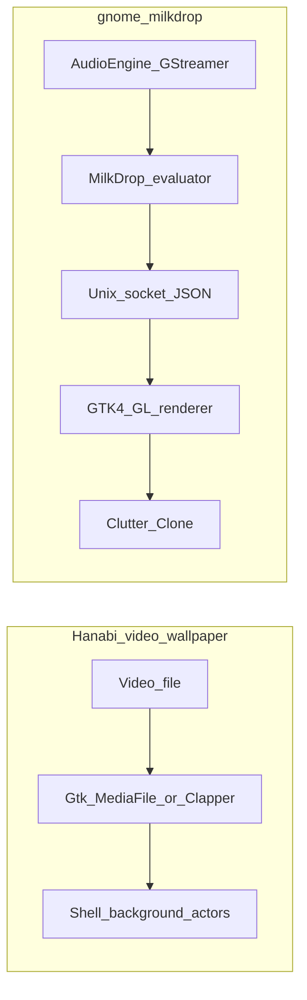

# GNOME extensions benchmark: animated wallpaper and system audio

This document compares open GNOME Shell extensions (and this project) that either drive **live desktop or lock-screen backgrounds** or capture **system audio** for visualization. It situates **gnome-milkdrop** relative to **Hanabi** (video wallpaper patterns) and **MilkDrop-style** procedural rendering.

For design choices inherited from Hanabi, see [hanabi-learnings.md](hanabi-learnings.md). For monitor-source probing details, see [pipewire-audio-source-research.md](pipewire-audio-source-research.md). For reference behavior and parity work, see [projectm-parity.md](projectm-parity.md). Module boundaries are summarized in [architecture.md](architecture.md).

## Why Hanabi + MilkDrop-style engine

- **Hanabi** validates a **separate GTK4 renderer process**, Wayland subprocess ownership, and hiding renderer windows from the overview—without running OpenGL inside `gnome-shell`.
- **MilkDrop / projectM-style** presets need **per-frame and per-vertex math**, a **wide audio feature set** (spectrum, waveform, beat), and a **stable GL pipeline**; that fits a dedicated renderer + IPC better than decoding video paintables in the shell alone.
- **Gap vs pure video wallpaper**: Hanabi does not implement spectral analysis or expression evaluation. **Sound Visualizer**–class extensions do audio in the shell but not full-screen OpenGL wallpapers.

## Summary comparison

| Project | Visual surface | Audio / analysis | Stack notes |
|--------|----------------|------------------|-------------|
| [Hanabi](https://github.com/jeffshee/gnome-ext-hanabi) | Desktop video wallpaper via GTK4 media (`Gtk.MediaFile`, GStreamer underneath); optional [**Clapper** `clappersink`](https://github.com/Rafostar/clapper) for performance | Not a music visualizer | Often needs `libgtk-4-media-gstreamer`; README covers NVIDIA / GStreamer cache issues |
| **gnome-milkdrop** (this repo) | **`Clutter.Clone`** of a hidden GTK4 **OpenGL** window; [**frame-state over Unix socket**](../CLAUDE.md) | **GStreamer**: `pipewiresrc` / `pulsesrc` on monitor devices, **spectrum** element, **appsink** PCM, beat logic in JS (`src/extension/audio.js`) | Split process: shell = audio + evaluator + IPC; renderer = GL |
| [Live Lock Screen](https://github.com/nick-redwill/LiveLockScreen) | **Lock screen only**: video loop, **GStreamer** + **`gtk4paintablesink`** | Optional audio is **playback** of the video file (volume / fade), not system mix monitoring | GNOME Shell 46+; good/bad/ugly plugins; different actor tree than desktop background |
| [live_wallpaper_gnome](https://github.com/tridoxx/live_wallpaper_gnome) | Desktop video on **Wayland**, **GNOME 49**; **`Clutter.Video`** + **GStreamer** | Not focused on visualization | Work in progress; primary monitor only (per upstream readme) |
| [Sound Visualizer](https://github.com/raihan2000/visualizer) / [GitLab mirror](https://gitlab.com/raihan2000/visualizer) | Panel / overlay visualizer, not full wallpaper | **GStreamer**, real-time bands, Wayland-oriented; **archived / low maintenance** | Useful reference for **source selection** and band UI in the shell |
| [Dynamic Music Pill](https://github.com/Andbal23/dynamic-music-pill) | Top-bar pill widget | “Real-time” mode uses external [**cava**](https://github.com/karlstav/cava); volume via **PulseAudio/PipeWire** | Pattern: **subprocess** + CLI instead of an in-process GStreamer graph in the extension |

## Comparison dimensions

1. **Drawing surface** — Clone of a foreign window vs `Clutter.Video` / paintable vs lock-screen-only actors.
2. **Process model** — All logic in **shell** vs **renderer subprocess** + IPC (gnome-milkdrop, Hanabi-style launcher).
3. **Audio capture** — `pulsesrc` / `pipewiresrc` (PipeWire exposes Pulse-compatible monitor devices) vs **cava** vs none.
4. **Distro dependencies** — GStreamer plugin sets, `gstreamer1-plugin-gtk4` / `gstreamer1.0-gtk4`, GTK4 media backend, optional Clapper.
5. **Risk** — Extensions still run in **`gnome-shell`**; heavy work should stay out of the main loop (IPC queue caps, no blocking writes—see CLAUDE.md).

## Architecture sketch (Hanabi vs gnome-milkdrop)

## Sources verified for this doc

- Hanabi: [README](https://raw.githubusercontent.com/jeffshee/gnome-ext-hanabi/master/README.md) (GTK4 media, Clapper, troubleshooting).
- Live Lock Screen: [README](https://raw.githubusercontent.com/nick-redwill/LiveLockScreen/master/README.md) (GStreamer, `gtk4paintablesink`, lock screen scope).
- live_wallpaper_gnome: repository `readme.md` on `main` ([GitHub API contents](https://api.github.com/repos/tridoxx/live_wallpaper_gnome/readme)) — **Clutter.Video**, GStreamer, Wayland, GNOME 49, primary monitor only.

Other rows rely on upstream READMEs / extension listings; re-verify before citing version-specific claims.

## Codebases to read (implementation mining)

Beyond README-level comparison, these repositories are worth **opening in an editor or GitHub search** when you need concrete patterns. Aligns with [architecture.md](architecture.md) (shell: audio, IPC, evaluator; renderer: GL, mesh, shaders).

**Local snapshots** (verbatim upstream files for diffing against this repo): [reference-codebases/README.md](reference-codebases/README.md).

**Related internal docs** (avoid duplicating them here): [hanabi-learnings.md](hanabi-learnings.md), [pipewire-audio-source-research.md](pipewire-audio-source-research.md), [projectm-parity.md](projectm-parity.md).

| Codebase | Where to read | Leverage hypothesis |
|----------|---------------|---------------------|
| [Hanabi](https://github.com/jeffshee/gnome-ext-hanabi) `src/` | `Meta.WaylandClient` / renderer subprocess; hiding renderer from overview; prefs; per-monitor lifecycle | See hanabi-learnings; re-audit when GNOME Shell APIs change (e.g. 49+). |
| [Sound Visualizer](https://github.com/raihan2000/visualizer) / [GitLab](https://gitlab.com/raihan2000/visualizer) | GStreamer pipeline in GJS inside the extension; device/source selection; band UI | Ideas for **user-facing source prefs** or fallback ordering vs [`src/extension/audio.js`](../src/extension/audio.js). |
| [Dynamic Music Pill](https://github.com/Andbal23/dynamic-music-pill) | Spawning **cava**, reading stdout/fifo; top-bar integration | **Subprocess analysis** pattern if you ever want to compare latency or offload FFT out of the shell process. |
| [cava](https://github.com/karlstav/cava) | Pulse/PipeWire input, FFT, smoothing, config | Numeric / UX reference for bars; not a drop-in replacement for in-process spectrum without a product decision. |
| [Live Lock Screen](https://github.com/nick-redwill/LiveLockScreen) | Pipeline with `gtk4paintablesink`, loop, multi-monitor on lock | Video decode to paintable; parallel to Hanabi; low priority for pure MilkDrop GL unless you mix media. |
| [live_wallpaper_gnome](https://github.com/tridoxx/live_wallpaper_gnome) | `Clutter.Video` in Shell vs foreign-window clone | Architectural alternative to [`src/extension/wallpaper.js`](../src/extension/wallpaper.js) (different GL isolation tradeoff). |
| [Clapper](https://github.com/Rafostar/clapper) | `clappersink`, GTK4 integration | Only if the renderer gains **video playback**; Hanabi README already motivates performance. |
| [projectM](https://github.com/projectM-visualizer/projectm) | Presets, tests, audio/GL issues and PRs | Parity and goldens: projectm-parity + `tests/parity/`; mine upstream for edge cases. |
| **GStreamer** (freedesktop / distro sources) | `spectrum`, `pipewiresrc`, `pulsesrc` caps and bus messages | Clarify element limits vs PCM in appsink; complements pipewire-audio-source-research. |

### Code search checklist (reproducible)

In each cloned repo or GitHub “search in this repository”:

1. **Audio** — `pipewiresrc`, `pulsesrc`, `Gst.parse`, `spectrum`, `appsink`, `monitor`, `@DEFAULT_MONITOR@`.
2. **Shell / Wayland** — `WaylandClient`, `Meta.Display`, `BackgroundActor`, `Clutter.Clone`, `Clutter.Video`.
3. **IPC / process** — `Gio.Subprocess`, `spawn`, `socket`, `DBus` (typical in Hanabi-style extensions).
4. **GL / GTK** — `GtkGLArea`, `GdkGLContext` (compare with [`src/renderer/`](../src/renderer/)).

For each interesting hit, note **file**, **pattern**, and **applicable: yes/no + why** in your own notes or PR description (optional team log: `docs/codebase-mining-log.md` — not required by default).

### Out of scope for this document

- No mandated code changes to `audio.js` or `wallpaper.js` from mining alone.
- No CI job to clone all upstream repos; mining stays **manual or task-driven**.

## v2 implementation notes (current status)

- Frame-state hot path now avoids JSON deep-clone of audio data before evaluator pass.
- Extension/renderer IPC now carries protocol metadata (`protocolVersion`) on control messages for compatibility checks.
- Audio diagnostics are exposed in `GetWindowStatus()` for support triage in PipeWire/Pulse environments.
